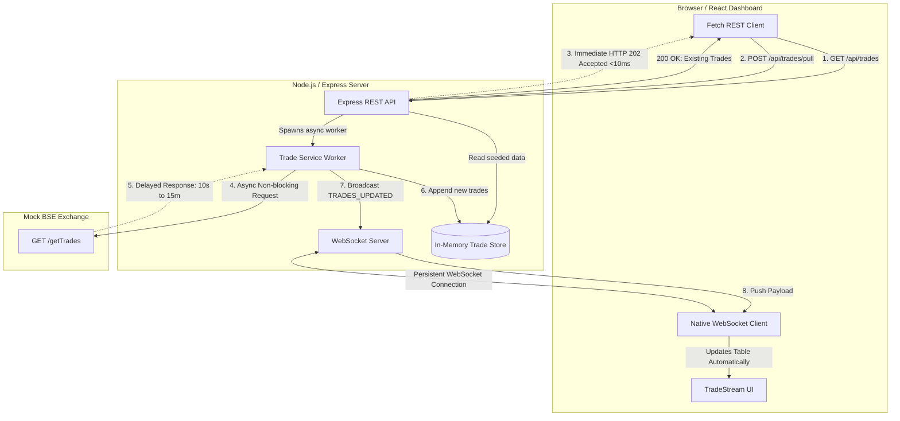

# TradeStream — Asynchronous Real-Time Ingestion System

A full-stack solution to ingest long-running trade records from the Bombay Stock Exchange (BSE) API without running into the 30-second network HTTP termination limit.

Built with **React**, **Node.js / Express**, native **WebSockets (`ws`)**, and an **in-memory trade store**.

---

## 1. Project Overview

### The Problem
* The real BSE Exchange trade pull is a heavy, batch-oriented operation that can take up to **15 minutes** to execute.
* Corporate firewalls, reverse proxies, and cloud infrastructure (load balancers, CDN gateways) automatically terminate any HTTP connection that remains idle or open for more than **30 seconds**.
* If a browser requests trade data via a standard synchronous HTTP call (`GET /api/trades`), the connection gets aborted with a `504 Gateway Timeout` or network reset long before BSE responds.
* Inexperienced solutions often attempt **polling loops** (`setInterval`), **page reloads**, or **cron jobs**, which introduce immense network congestion, wasted CPU cycles, and race conditions.

### The Solution
* **Immediate HTTP Response (202 Accepted):** When the client triggers a pull via `POST /api/trades/pull`, the backend acknowledges the request in under **10 milliseconds** and immediately terminates the HTTP connection.
* **Background Asynchronous Worker:** The Node.js server manages the long-running wait with the Mock BSE API (`GET /getTrades`) in the background event loop. The browser is never held waiting.
* **Real-Time Push via WebSockets:** When the BSE API returns trades, the backend stores them and broadcasts a `TRADES_UPDATED` WebSocket event containing the new trades.
* **Zero Polling & Zero Refresh:** The React dashboard receives the event, merges the trades into the view, highlights newly received rows, and updates metrics—without ever issuing another HTTP request or refreshing the page.

---

## 2. Architecture Diagram



---

## 3. Technology Stack

### Backend
- **Node.js & Express:** Lightweight, non-blocking HTTP server.
- **`ws`:** Fast, RFC 6455-compliant native WebSocket server mounted on the same HTTP port.
- **In-Memory Trade Store:** High-performance trade repository initialized with 2,500 seeded records and deduplication logic.

### Frontend
- **React (Vite SPA) & TypeScript:** Fast, type-safe reactive dashboard.
- **Native Browser WebSocket API:** Lightweight, zero external socket client libraries.
- **Tailwind CSS:** Modern, clean, responsive UI with real-time status indicators.

---

## 4. Getting Started & Setup

### Prerequisites
- Node.js >= 18.x
- npm >= 9.x

### Quick Start (Integrated Mode)

1. **Clone the repository:**
   ```bash
   git clone <repo-url>
   cd TradeStream
   ```

2. **Install dependencies:**
   ```bash
   npm install
   ```

3. **Configure Environment Variables:**
   ```bash
   cp .env.example .env
   ```
   Default settings in `.env`:
   ```env
   PORT=3000
   BSE_API_URL=http://localhost:3000/getTrades
   BSE_DELAY_MS=10000
   ```

4. **Start the complete full-stack application:**
   ```bash
   npm run dev
   ```
   Open [http://localhost:3000](http://localhost:3000) in your browser. Both the React dashboard, Express REST API, Mock BSE API, and WebSocket server run seamlessly on port 3000.

---

### Standalone Mock BSE Mode (Optional Multi-Service Setup)

If you prefer to run the Mock BSE API as a completely isolated service on port `4001`:

1. **Start the Standalone Mock BSE server:**
   ```bash
   npx tsx server/mockBseServer.ts
   ```
   *(Listens on `http://localhost:4001/getTrades`)*

2. **In a second terminal, configure `.env` and start the backend/frontend:**
   ```bash
   export BSE_API_URL=http://localhost:4001/getTrades
   npm run dev
   ```

---

## 5. API

### Mock BSE API
#### `GET /getTrades`
Simulates the long-running BSE exchange request.
* **Query Parameters:**
  - `delayMs` *(optional)*: Override the delay for this request (e.g. `5000`, `10000`, `60000`).
  - `fail` *(optional)*: If set to `true`, simulates an HTTP 500 BSE Gateway Error.
  - `count` *(optional)*: Number of trades to return (defaults to 350).
* **Response (HTTP 200):**
  ```json
  [
    {
      "tradeId": "BSE-002501",
      "client": "CLI-MEHTA-CAPITAL",
      "symbol": "RELIANCE",
      "quantity": 250,
      "price": 2854.20,
      "timestamp": "2026-10-07T10:30:15.000Z"
    }
  ]
  ```

---

### Backend Application REST API

#### `GET /api/trades`
Returns existing trade records stored in memory. Called upon dashboard mount to populate the view instantly.
* **Response (HTTP 200):**
  ```json
  {
    "trades": [...],
    "totalCount": 2500,
    "pullState": {
      "status": "idle",
      "lastPullTime": "2026-10-07T10:15:00.000Z",
      "tradesAddedLastPull": 0
    }
  }
  ```

#### `POST /api/trades/pull`
Initiates a background trade pull from the BSE exchange.
* **Crucial Behavior:** Responds in `<10ms` with HTTP 202. Does NOT wait for BSE.
* **Payload (optional):**
  ```json
  {
    "delayMs": 10000,
    "fail": false
  }
  ```
* **Response (HTTP 202 Accepted):**
  ```json
  {
    "message": "Trade pull started",
    "started": true
  }
  ```
* **Response if pull already active (HTTP 409 Conflict):**
  ```json
  {
    "message": "A trade pull is already in progress. Concurrent duplicate pulls are prohibited.",
    "started": false
  }
  ```

---

## 6. WebSocket Protocol

The WebSocket server listens on `/ws`.

### Broadcast Events

1. **`PULL_STATUS`:** Broadcast when a pull begins.
   ```json
   {
     "type": "PULL_STATUS",
     "status": "pulling",
     "startedAt": "2026-10-07T10:35:00.000Z",
     "configuredDelayMs": 10000
   }
   ```

2. **`TRADES_UPDATED`:** Broadcast when BSE data arrives.
   ```json
   {
     "type": "TRADES_UPDATED",
     "trades": [ ... ],
     "totalCount": 2850,
     "timestamp": "2026-10-07T10:35:10.000Z",
     "batchSize": 350
   }
   ```
   *Note: React merges the `trades` payload directly into state. It does NOT make another HTTP call.*

3. **`PULL_FAILED`:** Broadcast if BSE API encounters an error.
   ```json
   {
     "type": "PULL_FAILED",
     "message": "BSE Exchange Gateway Timeout / Connection Refused",
     "timestamp": "2026-10-07T10:35:10.000Z"
   }
   ```

---